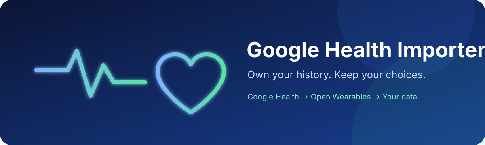
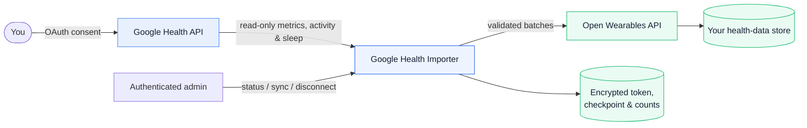
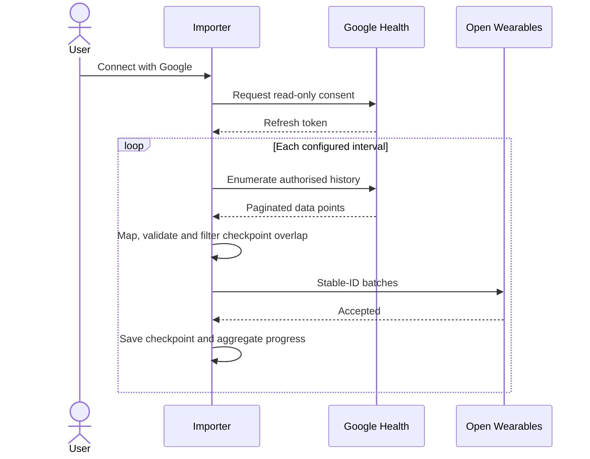

<p align="center"></p>

<p align="center">
  <a href="LICENSE"></a>
  
  
  
</p>

# Google Health Importer

A small, auditable bridge that preserves your Google Health history in an
[Open Wearables](https://github.com/the-momentum/open-wearables) instance you
control. It is person-centric rather than device-centric: Google, Fitbit and
future devices are data sources; the durable asset is your health history.

> [!IMPORTANT]
> This is independent community software. It is not affiliated with or
> endorsed by Google, Fitbit, or Open Wearables. It is not a medical device and
> does not provide medical advice.

> [!NOTE]
> **AI disclosure:** this project was vibe-coded by Mark Brown in collaboration
> with OpenAI ChatGPT and Codex. AI assisted with architecture, implementation,
> tests, documentation, research and live deployment troubleshooting. The
> importer itself contains no AI integration and does not send health data to
> an AI service. Read the full [AI development disclosure](docs/AI_DISCLOSURE.md).

## Why it exists

- Own and preserve health data independently of a particular device vendor.
- Import complete authorised history, then keep it updated automatically.
- Use only narrow, read-only Google Health permissions.
- Keep credentials encrypted and health values out of logs.
- Use Open Wearables' supported ingestion API—never modify its database.

## Architecture



| Data | Importer | Open Wearables | Logs |
| --- | --- | --- | --- |
| Google refresh token | Encrypted at rest | No | Never |
| Health records | In memory while batching | Yes | Never |
| Last-sync checkpoint | Encrypted at rest | No | No |
| Progress | Aggregate counts | Sync metadata | Aggregate only |

## Synchronisation lifecycle



The first successful sync imports authorised history from
`GOOGLE_HISTORY_START_DATE`. Set it to the date the device or Google Health
account began collecting useful data. Bounded data types such as Total Calories
are fetched newest-first with Google's physical-time `rollUp` operation using
UTC-midnight-aligned one-day windows. Only completed days are requested, so the
newest total is yesterday's and today is picked up automatically after midnight.
This satisfies the live API's otherwise undocumented alignment requirement, while current data
arrives before older history. If Google refuses an older derived-total day, the
supported recent totals are retained and the importer continues. Other metrics
use Google Health's record-specific
time filters, avoiding enumeration outside the configured history or checkpoint
window. Later runs use a ten-minute overlap. Stable record IDs make retries
duplicate-safe. Runs never overlap; temporary failures use exponential backoff
capped at six hours.

## Supported data

- Heart rate, intraday HRV (RMSSD) and daily HRV
- Intraday and daily oxygen saturation
- Resting heart rate and sleep respiratory-rate summaries
- Nightly skin-temperature derivations
- Steps, distance, calories, active minutes and Active Zone Minutes
- VO₂ max and run VO₂ max
- Workouts with type, duration, distance, steps, calories, heart rate,
  elevation, speed and available zone summaries
- Sleep stages
- Compatible measurements such as weight, body fat, height, core body
  temperature and blood glucose when present in Google Health

The importer requests only these OAuth scopes:

```text
googlehealth.health_metrics_and_measurements.readonly
googlehealth.activity_and_fitness.readonly
googlehealth.sleep.readonly
```

## Quick start

### 1. Prepare secrets

Copy [`.env.example`](.env.example), generate unique secrets, and supply every
required value through your deployment platform—not Git.

```bash
python -c "from cryptography.fernet import Fernet; print(Fernet.generate_key().decode())"
```

`TOKEN_ENCRYPTION_KEY` must remain stable for the persistent volume. Generate
`APP_SESSION_SECRET` with a password manager. Set `PUBLIC_CONTACT_EMAIL` to a
monitored address for privacy and deletion requests; it is displayed publicly
on `/privacy`. Set `GOOGLE_HISTORY_START_DATE` in `YYYY-MM-DD` form to the
earliest date worth importing—for example, the date you first wore the device.
The conservative default is `2009-01-01`.

### 2. Deploy behind HTTPS

```bash
docker compose up -d --build
```

The compose file publishes port `8010`; point a secure reverse proxy hostname
at it.

### 3. Configure Google OAuth

Create a Google OAuth web client with callback:

```text
https://your-importer.example/oauth/callback
```

Set the OAuth homepage to `https://your-importer.example/` and privacy-policy
URL to `https://your-importer.example/privacy`. Verify the domain in Google
Search Console. Consent-screen scopes must exactly match the three read-only
scopes above.

### 4. Connect and observe

Open `/oauth/start`, authenticate with `APP_ADMIN_USER` and
`APP_SESSION_SECRET`, and grant consent. Administrative routes use the same
HTTP Basic credentials:

| Endpoint | Purpose | Authentication |
| --- | --- | --- |
| `GET /` | Public product homepage | No |
| `GET /privacy` | Public privacy policy | No |
| `GET /health` | Liveness check | No |
| `GET /status` | Connection and aggregate progress | Yes |
| `GET /status/view` | Human-readable status and coverage dashboard | Yes |
| `POST /dashboard/rebuild` | Reconstruct historical coverage, latest values and 24-hour charts | Yes |
| `POST /sync` | Start a non-overlapping sync | Yes |
| `POST /disconnect` | Revoke Google access and erase importer state | Yes |

## Google policy readiness

The software supports the technical parts of a compliant deployment:

- a clear public homepage and privacy policy;
- narrow read-only scopes with no unused profile permission;
- disclosure of access, use, storage, transfer and retention;
- no advertising, sale, surveillance or general-purpose AI training;
- authenticated revocation and deletion of importer-held state;
- encrypted refresh token and external deployment secrets;
- aggregate logging without health values.

The deployer remains responsible for steps code cannot perform: accurate
operator/contact details, a verified owned domain, matching OAuth URLs, an
appropriate consent flow, and Google verification when required. Personal-use
apps with fewer than 100 users may be exempt from verification but remain
subject to Google's data-use policies.

Official references: [API Services User Data Policy](https://developers.google.com/terms/api-services-user-data-policy),
[Google Health API policy](https://developers.google.com/health/policies/health-api-developer-user-data-policy),
[scopes guidance](https://developers.google.com/health/scopes), and
[OAuth verification requirements](https://support.google.com/cloud/answer/13464321).
The repository also includes an operator-facing
[Google OAuth publication checklist](docs/GOOGLE_OAUTH_CHECKLIST.md).

## Operations and recovery

The authenticated status dashboard reports connection, scheduler, historical
coverage, each available category's latest value and animated 24-hour charts.
The mobile-friendly chart selector draws one bounded series at a time and avoids
full-page automatic reloads.
`POST /dashboard/rebuild` reconstructs those summaries from Google without
resending records to Open Wearables. The encrypted state retains only the latest
value and a bounded 24-hour chart series, not a second full health database.

Optional Apprise notifications report repeated sync failures and recovery.
Configure one or more whitespace-separated notification URLs in `APPRISE_URLS`;
notification messages contain operational state but no readings.
The importer also detects a healthy-but-stale pipeline: if no source record has
arrived for `DATA_STALE_AFTER_HOURS` (six hours by default), it sends one warning
and then a recovery notification when fresh data returns.

- [Operations and monitoring](docs/OPERATIONS.md)
- [Backup and recovery](docs/BACKUP_AND_RECOVERY.md)

## Security and privacy

- Never commit OAuth credentials, API keys, refresh tokens or populated state.
- Use HTTPS and a strong, unique administrator password.
- Protect and back up the persistent volume as sensitive data.
- Rotate any credential disclosed in chat, logs or screenshots.
- `POST /disconnect` revokes Google access and erases importer state; imported
  records remain under the user's control in Open Wearables.

Read [SECURITY.md](SECURITY.md) and the deployed `/privacy` page before inviting
other users.

## Development

```bash
python -m venv .venv
. .venv/bin/activate
pip install -e ".[test]"
pytest
```

## Licence and acknowledgements

Released under the [MIT Licence](LICENSE). Dependency and interoperability
notices are in [THIRD_PARTY_NOTICES.md](THIRD_PARTY_NOTICES.md). Open Wearables
is an integration target; none of its source code is copied here.

## How this was made

This is deliberately disclosed as an AI-assisted, vibe-coded project—not
presented as conventionally authored software. Human direction, automated
tests and live verification were used to check the generated work, but they do
not eliminate risk. Review the code and operate it as sensitive software.
